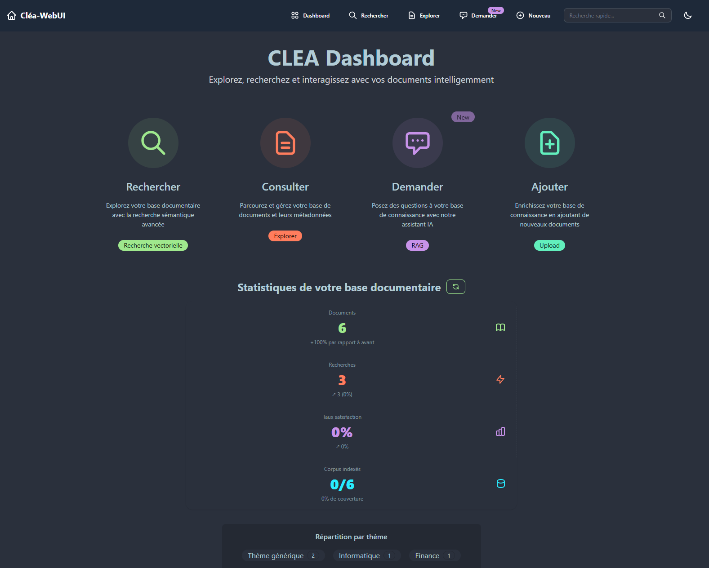
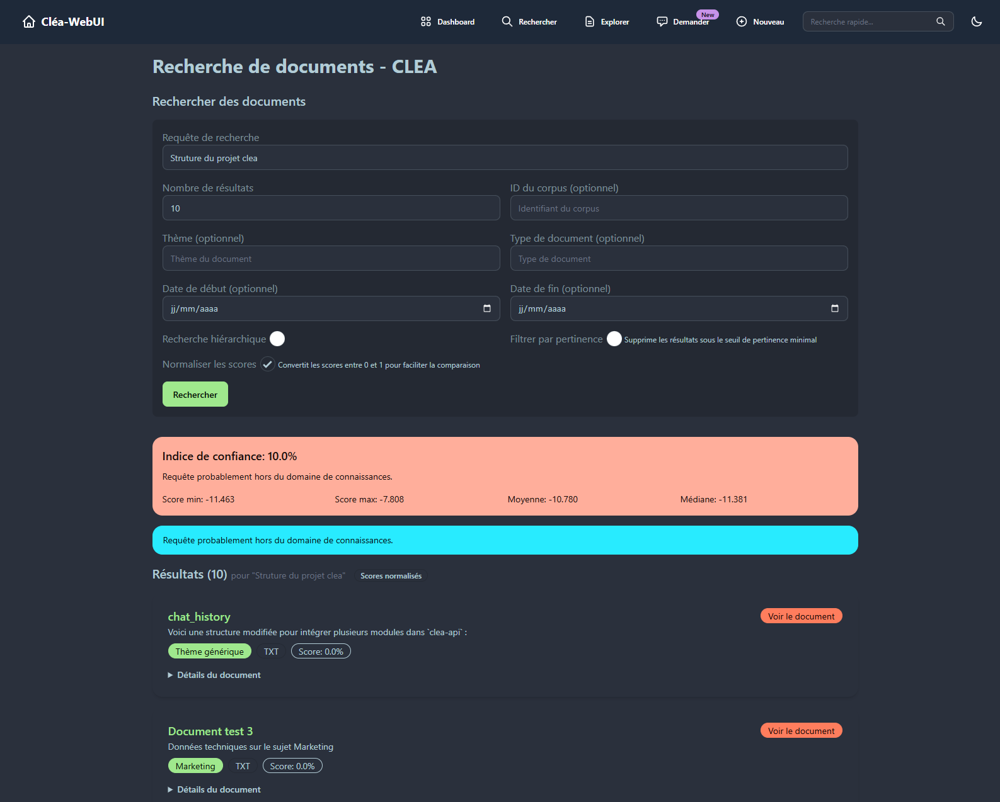
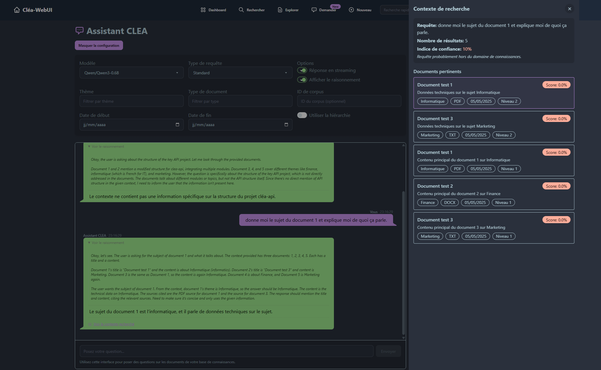
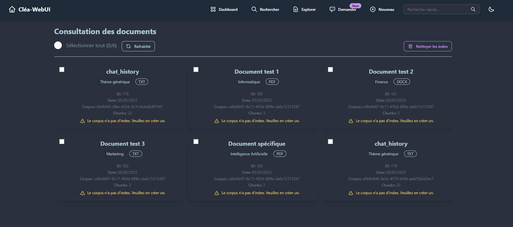
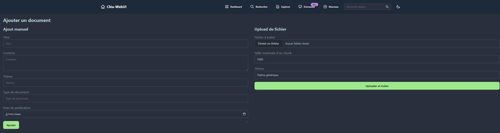

# CLEA WebUI

[]()
[]()
[]()

Interface web pour CLEA (Corpus Linker & Exploratory Assistant), une plateforme de recherche et d'exploration documentaire intelligente basée sur les technologies RAG (Retrieval-Augmented Generation).

## 📸 Aperçu de l'interface

<div align="center">
  <a href="docs/img/dashboard.png" target="_blank">
    
  </a>
  <p><em>Tableau de bord principal avec statistiques et navigation</em></p>
</div>

<div align="center" style="display: flex; flex-wrap: wrap; justify-content: center; gap: 10px; margin-top: 20px;">
  <div style="flex: 0 0 45%; text-align: center;">
    <a href="docs/img/search.png" target="_blank">
      
    </a>
    <p><em>Recherche sémantique avancée</em></p>
  </div>
  <div style="flex: 0 0 45%; text-align: center;">
    <a href="docs/img/ask.png" target="_blank">
      
    </a>
    <p><em>Assistant IA avec RAG</em></p>
  </div>
  <div style="flex: 0 0 45%; text-align: center;">
    <a href="docs/img/explorer.png" target="_blank">
      
    </a>
    <p><em>Exploration de la base documentaire</em></p>
  </div>
  <div style="flex: 0 0 45%; text-align: center;">
    <a href="docs/img/add.png" target="_blank">
      
    </a>
    <p><em>Interface d'ajout de documents</em></p>
  </div>
</div>

## 📋 Fonctionnalités principales

- **Recherche sémantique avancée**: Explorez vos documents avec une recherche par similarité vectorielle.
- **Gestion de documents**: Consultez, ajoutez et gérez votre base documentaire.
- **Assistant IA**: Posez des questions à votre base de connaissances via un assistant IA (RAG).
- **Tableaux de bord statistiques**: Visualisez des métriques détaillées sur votre corpus.

## 🛠️ Prérequis

- Node.js 20+
- npm ou yarn
- [CLEA API](https://github.com/WillIsback/clea-api) (backend) accessible
- Pour le déploiement: Docker et Docker Compose

## 💻 Développement

### Installation

```bash
# Cloner le repository
git clone https://github.com/yourusername/clea-webui.git
cd clea-webui

# Installer les dépendances
npm install

# Configurer les variables d'environnement
cp .env.example .env
# Éditer .env et définir PUBLIC_API_URL à l'URL de votre instance CLEA API
```

### Lancer le serveur de développement

```bash
npm run dev

# ou avec hôte exposé
npm run dev -- --host
```

L'application sera disponible sur [http://localhost:5173](http://localhost:5173).

### Tests

```bash
# Exécuter tous les tests
npm test

# Exécuter les tests en mode watch
npm run test:unit
```

## 🚀 Déploiement

CLEA WebUI est configuré pour un déploiement conteneurisé avec Docker et Nginx.

### Avec Docker Compose

```bash
# Construire et démarrer les conteneurs
docker-compose up -d

# Suivre les logs
docker-compose logs -f
```

### Configuration SSL

1. Placez vos certificats SSL dans ssl:

   - `cert.pem`: votre certificat
   - `key.pem`: votre clé privée

2. Configurez votre domaine dans default.conf

### Sans Docker

Si vous préférez un déploiement sans Docker:

```bash
# Construire l'application
npm run build

# Démarrer en production
npm run preview
```

## 🧩 Architecture

### Structure du projet

```
.
├── src/
│   ├── lib/           # Librairies et utilitaires
│   │   ├── database.ts  # Fonctions d'accès à la base de données
│   │   ├── index.ts     # Fonctions pour gérer les index
│   │   ├── rag.ts       # Fonctions RAG pour l'assistant
│   │   ├── search.ts    # Fonctions de recherche
│   │   ├── stats.ts     # Fonctions pour les statistiques
│   ├── routes/        # Pages de l'application
│   │   ├── ask/         # Assistant IA
│   │   ├── database/    # Gestion des documents
│   │   ├── search/      # Recherche sémantique
├── static/           # Fichiers statiques
├── docker-compose.yml  # Configuration Docker Compose
└── Dockerfile        # Configuration Docker
```

### Intégration avec CLEA API

CLEA WebUI interagit avec CLEA API via les endpoints suivants:

- `/search`: Recherche sémantique dans les documents
- `/database`: Gestion des documents et métadonnées
- `/ask`: Requêtes à l'assistant IA (RAG)
- `/stats`: Statistiques du système
- `/index`: Gestion des index vectoriels

## 🔧 Personnalisation

### Thème

CLEA WebUI utilise DaisyUI avec TailwindCSS. Vous pouvez modifier le thème en éditant les configurations dans:

- `tailwind.config.js`: pour les personnalisations TailwindCSS
- app.css: pour les styles globaux

### Configuration de l'API

L'URL de l'API peut être configurée via:

- Variable d'environnement `PUBLIC_API_URL`
- Dans le fichier `.env` pour le développement
- Dans docker-compose.yml pour le déploiement

## 📝 Licence

MIT

## 🤝 Contribution

Les contributions sont les bienvenues! N'hésitez pas à ouvrir une issue ou une pull request.

1. Forker le projet
2. Créer une branche (`git checkout -b feature/amazing-feature`)
3. Committer vos changements (`git commit -m 'Add some amazing feature'`)
4. Pusher vers la branche (`git push origin feature/amazing-feature`)
5. Ouvrir une Pull Request
